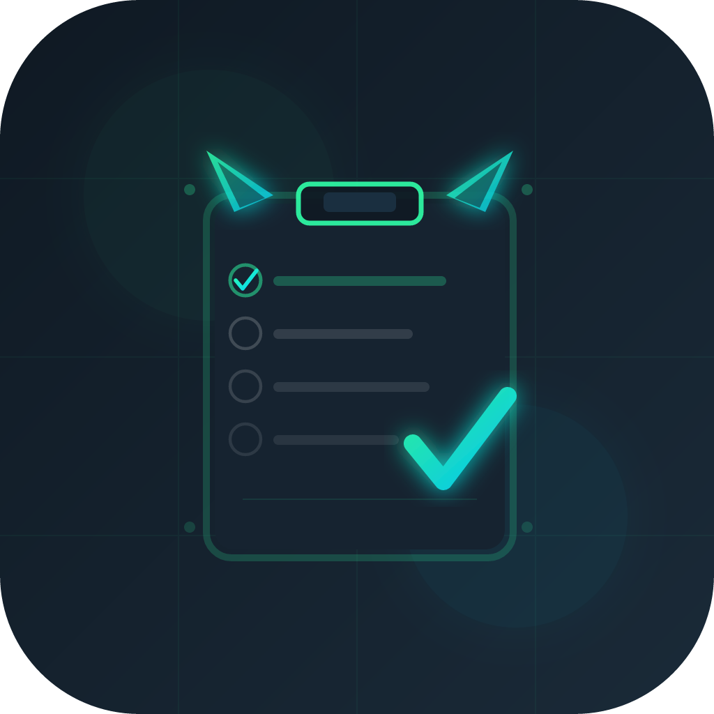

# TaskLyn 🚀
### Minimalist. Efficient. Local-First.

TaskLyn is a premium task management application designed for high-performance desktop workflows. It combines the speed of a local tool with a polished, modern aesthetic, helping you stay focused on what matters most.

## ✨ Key Features

- **⚡ Type-to-Start**: Just start typing anywhere in the app to instantly create a new task. Your thoughts drop directly into your list without missing a beat.
- **📝 Rich Text Descriptions**: Add context with bold, italics, checklists, and links. Links automatically detect protocols and open in your default browser.
- **📂 Folder Organization**: Categorize your life with a sleek folder system integrated directly with your Documents folder.
- **📅 Daily Archival Engine**: Every night at midnight, TaskLyn automatically archives your completed work into clean Markdown and JSON logs.
- **✨ Carry-Forward Logic**: Never lose track of pending work. Unfinished tasks are automatically moved to the next day, while your progress is safely logged.
- **📊 Activity Heatmap**: Visualize your productivity with a calendar-based heatmap that shows exactly which days you were most active.

## ⌨️ Productivity Shortcuts

Master your workflow with keyboard-first interactions:

| Shortcut | Action |
| :--- | :--- |
| **Any Character** | Focus "Add Task" input and start typing |
| `Ctrl + N` | Manually focus "Add Task" input |
| `Ctrl + F` | Focus Search & Filter bar |
| `Ctrl + Enter` | Save and submit from the description editor |
| `Esc` | Clear selection or close modals |

## 🛡️ Privacy & Security

- **100% Local**: Your data never leaves your machine. Your tasks, notes, and folders are stored locally on your PC.
- **Open Standards**: Archives are saved in standard Markdown and JSON formats, so you always own your data.
- **Portable Backups**: Export and Import your entire database with a single click from the Settings menu.

## 🚀 Getting Started

1.  **Download**: Run the `TaskLyn Setup 0.1.0.exe` installer.
2.  **Organize**: Create your first folder (e.g., "Work", "Personal").
3.  **Capture**: Start typing to add tasks. Use `Ctrl + Enter` to save.
4.  **Reflect**: Use the History icon to view your past achievements and productivity heatmap.

---

*Designed for those who value speed, elegance, and data ownership.*
